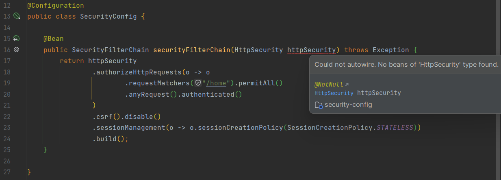
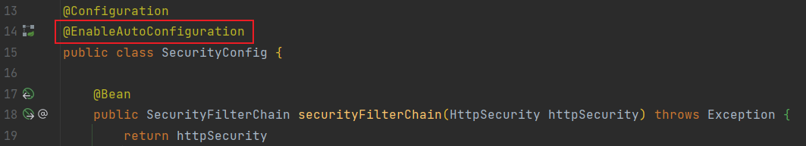

# problem reproduction project

See https://youtrack.jetbrains.com/issue/IDEA-316836

<a href="https://youtrack.jetbrains.com/articles/IDEA-A-2100661478/IntelliJ-IDEA-2023.1-231.8109.175-build-Release-Notes">IntelliJ IDEA 2023.1 (231.8109.175 build)</a>

## What steps will reproduce the issue?
1. The class that assembles the bean is not in the same package as the startup class.
2. The startup class @SpringBootApplication sets the scanBasePackages property.
3. Assembling the bean-like Spring Security configuration class as an example.

## What is the expected result?
There is no red line below the httpSecurity parameter, and IDEA has no error message

## What happens instead?
IDEA prompts an error, as shown in the figure, but the program runs normally.

## My point of view
This problem has no actual impact on the code. I encountered this problem from time to time in previous versions of IDEA. I think it is related to the version of IDEA, because the same code did not have this problem in the previous version 2022.3, so I think This might be a problem with IDEA. My Temporary solution:

